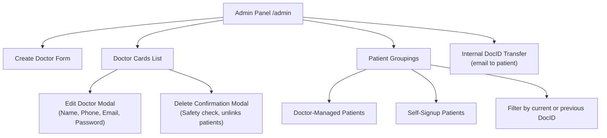

# Admin Portal Operational Guide

## Overview

The **Admin Portal** (`/admin`) provides executive-level administration across all doctors, clinics, and patients on the Candela platform.

---

## 1. Features & Workflows

---

## 2. Managing Doctors

### Creating a Doctor
1. Fill out **Name**, **Phone**, **Email**, and **Password** (min 8 characters).
2. Click **Create Doctor**.
3. The system generates an encrypted password hash and a unique 6-character **DocID**.
4. An instant success toast confirms doctor creation.

### Editing Doctor Details
1. Click the **Edit (pencil)** icon on any Doctor card.
2. The modal pre-fills existing **Name**, **Phone**, and **Email**.
3. To update password, type a new password (min 8 chars) or leave blank to keep the current password.
4. Click **Save Changes**. Changes take effect immediately without database intervention.

### Deleting a Doctor (Safeguarded)
1. Click the **Delete (trash)** icon on any Doctor card.
2. A confirmation modal appears, displaying the doctor's name, email, and DocID.
3. Confirming deletion executes a clean cascade:
   - Revokes active refresh tokens.
   - Unlinks managed patients (sets `doctorId = null`).
   - Deletes `DoctorProfile` and `User` records.
4. An info toast confirms removal.

---

## 3. Reviewing Patients

The Admin dashboard categorizes all patients on the platform:
- **Patients managed by doctors**: Grouped by supervising clinician and DocID.
- **Self-signup patients**: Independent users who registered directly on the website.

---

## 4. Internal DocID Transfer

1. Choose a patient and the **target DocID**.
2. Click **Request transfer**.
3. The **patient** receives a confirmation email (only Internal goes to the patient).
4. On Yes, the current DocID is replaced and the old code is stored in history.
5. Filter the patient lists by current or previous DocID.

See [DOCID_AND_MAIL.md](./DOCID_AND_MAIL.md).
