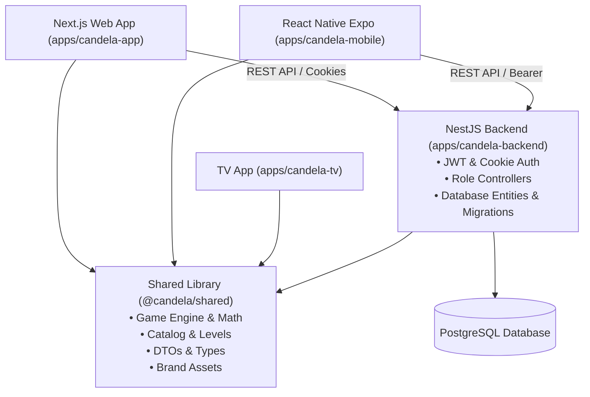

# Candela Platform Architecture

## 1. System Overview

**Candela** is a precision visual and cognitive therapy platform delivering interactive vision exercises across Web, Mobile (Expo / React Native), and future TV platforms, powered by a unified NestJS backend.



---

## 2. Monorepo Organization

```
Candela/
├── apps/
│   ├── candela-app/         ← Next.js 14+ (App Router) Frontend
│   │   ├── src/app/         ← Routes: /, /login, /signup, /dashboard, /doctor, /admin
│   │   ├── src/components/  ← UI components, game modules, headers, toasts, skeletons
│   │   ├── src/lib/         ← Auth context, Toast context, API client
│   │   └── public/          ← Static assets & favicons
│   │
│   ├── candela-backend/     ← NestJS API Server
│   │   ├── src/auth/        ← AuthController, AdminController, DoctorController, AuthService
│   │   ├── src/entities/    ← TypeORM Entities: User, DoctorProfile, PatientProfile, etc.
│   │   ├── src/migrations/  ← Database schema migrations
│   │   └── src/common/      ← Cookies, Guards, DocID generator, Catalog
│   │
│   ├── candela-mobile/      ← React Native / Expo Native App
│   └── candela-tv/          ← TV Platform (Platform TBD)
│
├── packages/
│   └── shared/              ← Pure TS / shared across apps & backend
│       ├── src/catalog.ts   ← Therapy modules metadata & definitions
│       ├── src/levels.ts    ← Game level playlists & presets
│       ├── src/auth-types.ts← Shared TypeScript models & summaries
│       └── assets/          ← Logos, sprites, and audio
│
└── docs/                    ← System documentation and operational guides
```

---

## 3. Technology Stack

| Layer | Technology | Key Details |
|---|---|---|
| **Web Frontend** | Next.js 14 (App Router) + TypeScript + Tailwind CSS | Fast SSR/Static generation, Client interactive therapy canvases |
| **Mobile Frontend** | React Native + Expo | Native touch, gestures, and audio feedback |
| **Backend API** | NestJS + TypeScript | Modular architecture, TypeORM, Passport JWT, Bcrypt |
| **Database** | PostgreSQL (Neon / Serverless Postgres) | Relational schema with migrations |
| **Monorepo** | TurboRepo + npm workspaces | Parallelized builds, linting, and shared caching |

---

## 4. Key Design Principles

1. **Shared Single Source of Truth**: All game catalogs, module IDs, level playlists, types, and brand assets reside in `packages/shared` to eliminate code duplication across platforms.
2. **First-Party Cookie & Bearer Dual Auth**: The backend simultaneously supports secure `httpOnly` cookies for Web (with cross-domain support) and `Bearer` tokens for Mobile/TV native clients.
3. **Graceful Cascading & Role Isolation**: Strictly isolated endpoints for `@Roles('admin')`, `@Roles('doctor')`, and `@Roles('patient')` with protective cascading database rules.
4. **Clinical Agility**: Doctors can dynamically adjust module prescriptions and granular level playlists for each patient without touching source code or database records.
