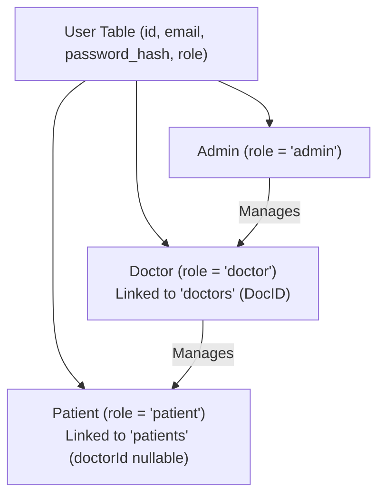
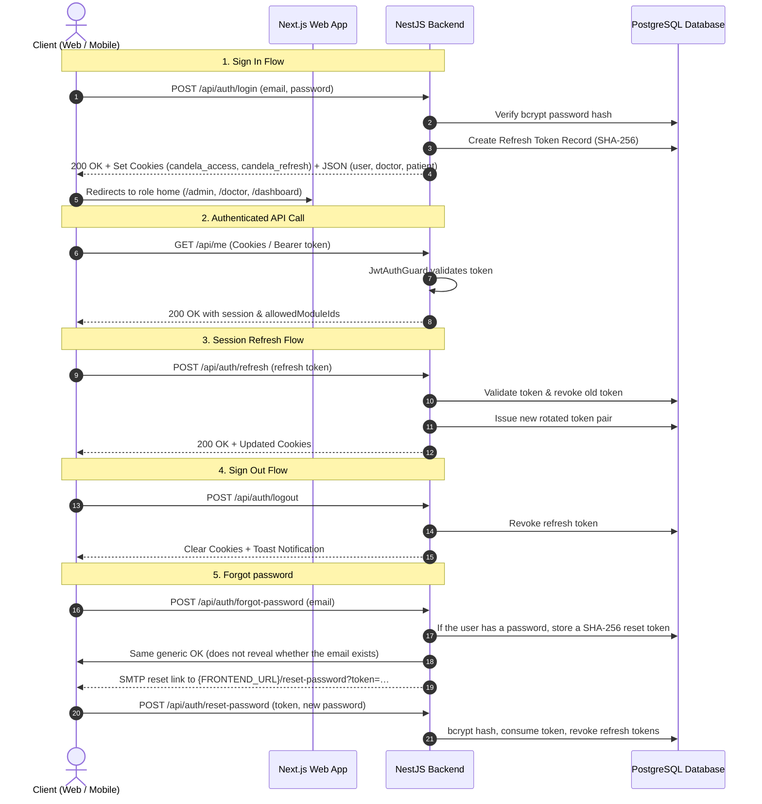

# Authentication, Roles & Session Flows

## 1. Role Hierarchy & Access Matrix

Candela supports 3 core roles stored on a unified `users` table:

### Access Matrix

| Role | Landing Route | Permitted Views | Actions & Capabilities |
|---|---|---|---|
| **Visitor / Unauthenticated** | `/` (Homepage) | `/`, `/login`, `/signup`, `/forgot-password`, `/reset-password` | Explore therapy tool descriptions, register, sign in, or reset a password |
| **Patient (Self-Signup)** | `/dashboard` | `/`, `/dashboard` | Play all catalog modules; finished plays save to analytics |
| **Patient (Doctor-Managed)**| `/dashboard` | `/`, `/dashboard` | Play prescribed modules; finished plays save to analytics |
| **Doctor** | `/doctor` | `/`, `/doctor` | Onboard patients, prescribe modules, view that patient’s session charts |
| **Admin** | `/admin` | `/`, `/admin` | Create doctors, edit doctor credentials, delete test doctors, inspect all platform patients |

---

## 2. Authentication Lifecycle

---

## 3. Session Management & Cookies

### Dual Token System
1. **Access Token (JWT)**:
   - Lifetime: **1 Day**
   - Payload: `{ sub: userId, email: string, role: Role, name: string }`
   - Transport: `httpOnly` cookie `candela_access` (Web) OR `Authorization: Bearer <token>` (Mobile/Native).
2. **Refresh Token (Opaque Hash)**:
   - Lifetime: **14 Days**
   - Storage: Cryptographic SHA-256 hash stored in `refresh_tokens` table.
   - Rotation: Automatically revoked upon use and re-issued.

### Cross-Origin Production Cookie Configuration
For decoupled deployments (e.g. Next.js on Vercel $\leftrightarrow$ NestJS on Render):
- `sameSite: 'none'`
- `secure: true`
- `httpOnly: true`
- `path: '/'`

---

## 4. Forgot password

Public pages: `/forgot-password` and `/reset-password?token=…` (web). Mobile can request a link; the email always opens the website.

| Method | Path | Who | Purpose |
|---|---|---|---|
| POST | `/api/auth/forgot-password` | Public | `{ email }`. Always `{ ok: true }`. Sends mail only if that user has a password hash. |
| POST | `/api/auth/reset-password` | Public | `{ token, password }` (min 8 chars). Consumes the token and revokes refresh tokens. |

Tokens are random, stored as SHA-256, single-use, default TTL **1 hour** (`PASSWORD_RESET_TTL_HOURS`). Mail uses the same `MailService` as DocID (`MAIL_TRANSPORT=smtp` or `log`). Google-only accounts (`password_hash` null) do not get a reset mail — they keep using Google Sign-In. Do not log emails or tokens (except `MAIL_TRANSPORT=log`, which prints the reset URL for local testing).

---

## 5. DocID Referral Mechanics

Every doctor account is assigned a unique **DocID** (referral code) automatically upon creation:
- **Format**: Exactly **6 alphanumeric characters** (e.g. `K9X2B4`).
- **Composition**: 3 uppercase letters (A–Z) and 3 digits (0–9).
- **Rule**: First character is always an uppercase letter.
- **Safety**: Generates with collision retries (up to 20 attempts).
- **Purpose**: Unique clinic/doctor tracking identifier linking patients to their supervising physician.

Patients can later **attach** or **change** that DocID. Admin can **transfer**. Confirmation is by SMTP email. Full flow: [DOCID_AND_MAIL.md](./DOCID_AND_MAIL.md).

Finished therapy plays (not login sessions) are documented in [SESSION_METRICS_AND_ANALYTICS.md](./SESSION_METRICS_AND_ANALYTICS.md).
