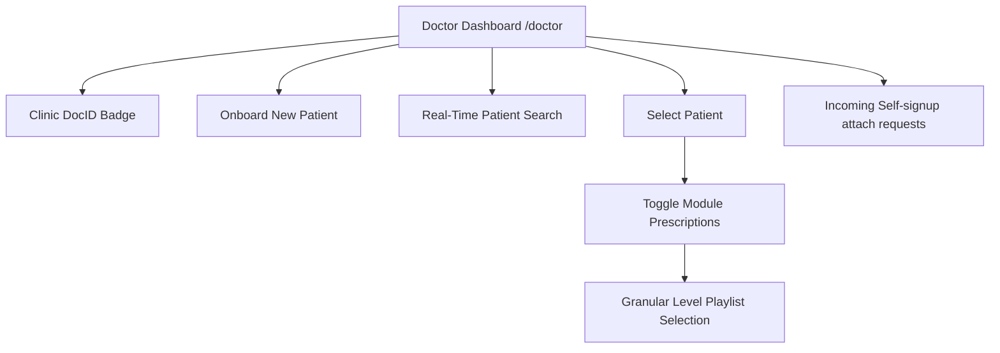

# Doctor Portal Clinical Guide

## Overview

The **Doctor Portal** (`/doctor`) gives ophthalmologists, optometrists, and vision therapists a dedicated workspace to onboard patients, customize therapy prescriptions, and track assignments.

---

## 1. Clinician Workflow

---

## 2. Onboarding Patients

1. Enter patient **Name**, **Phone**, **Email**, and initial **Password**.
2. Click **Create patient**.
3. The patient is automatically linked to the clinician's **DocID** (`origin: doctor_created`).
4. A success toast confirms patient creation and auto-selects the patient for immediate prescription setup.

---

## 2b. Incoming attach and reassignment

Patients can enter your DocID on **`/docid`** (header **DocID** from their dashboard) to **attach** (no doctor yet) or **switch** (already linked to someone else). **You** get the confirmation email (not the patient). Confirm or reject from the email, or from **Incoming attach requests** on `/doctor` if the mail is in spam.

After you confirm, prescribe modules — the patient then only sees what you assign.

See [DOCID_AND_MAIL.md](./DOCID_AND_MAIL.md).

---

## 3. Real-Time Patient Search

- **Search Bar**: Positioned at the top of the Patients list.
- **Search Scope**: Instantly filters by patient **name**, **email**, or **phone number** as you type.
- **Quick Clear**: Click the `X` icon inside the search input to reset the filter.

---

## 4. Customizing Prescriptions & Level Playlists

### Module Toggling
- Switch any therapy module **ON** or **OFF** for the selected patient.
- When a module is turned **ON**, all difficulty levels are enabled by default for clinical flexibility.

### Granular Level Playlist Customization
- Expand any prescribed module to view its individual difficulty tiers (e.g. Level 1 Easy, Level 2 Medium, Level 3 Complex, Speed/Contrast variations).
- Check or uncheck specific levels to assign tailored playlists matching the patient's visual motor recovery stage.
- Changes save instantly to the backend with confirmation toast notifications.
